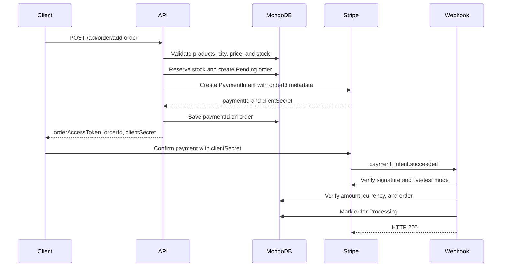

# Payment Processing Flow

This backend supports two payment methods:

- `Online`: Stripe PaymentIntent flow.
- `Cash`: cash on delivery. No Stripe PaymentIntent is created.

## Online Payment Flow



### Step 1: Client creates the order

Call:

```http
POST /api/order/add-order
Content-Type: application/json
```

Send the order details with:

```json
{
  "paymentMethod": "Online",
  "product": [
    {
      "productId": "...",
      "variantId": "...",
      "qty": 1
    }
  ],
  "cityId": "...",
  "firstName": "...",
  "lastName": "...",
  "email": "...",
  "phoneNumber": "...",
  "address1": "...",
  "address2": "..."
}
```

The API validates the products, available stock, prices, and delivery city. It calculates the subtotal, discount, delivery charge, and total.

### Step 2: Stock is reserved and the order is created

The backend reduces the selected variant stock before creating the Stripe payment. The order is saved with:

```text
orderStatus = Pending
paymentMethod = Online
```

The response includes an order access token for customer order lookups. Keep this token on the client and send it later using:

```http
X-Order-Access-Token: <order-access-token>
```

### Step 3: Stripe PaymentIntent is created

The backend creates a Stripe PaymentIntent using:

- Amount: order total converted to cents.
- Currency: `usd`.
- Automatic payment methods: enabled.
- Metadata: `{ orderId: "..." }`.
- Idempotency key: `order-<orderId>`.

The backend stores the Stripe PaymentIntent ID in `paymentInfo.paymentId` and returns the Stripe `clientSecret` to the client.

### Step 4: Client confirms the payment

The client uses the returned `clientSecret` with Stripe.js or the Stripe mobile SDK. The client should not mark the order as paid based only on the browser result.

The server-side webhook is the source of truth for payment completion.

### Step 5: Stripe sends the webhook

Stripe sends the event to:

```http
POST /api/online-payment/webhook
Stripe-Signature: <stripe-signature>
Content-Type: application/json
```

The application reads the webhook as raw JSON so Stripe signature verification can work. The webhook handler then:

1. Verifies the `Stripe-Signature` header.
2. Checks `STRIPE_WEBHOOK_SECRET_KEY`.
3. Rejects events from the wrong Stripe mode using `STRIPE_LIVE_MODE`.
4. Reads `orderId` from PaymentIntent metadata.
5. Finds the matching pending online order and PaymentIntent.
6. Verifies the payment status, currency, amount, and received amount.
7. Changes the order from `Pending` to `Processing`.
8. Stores the Stripe event ID and payment timestamp.

Duplicate success events are treated as already processed and do not process the order again.

## Failed or Canceled Payments

For these Stripe events:

```text
payment_intent.payment_failed
payment_intent.canceled
```

The backend finds the matching pending order and atomically changes it to:

```text
orderStatus = Reject
```

It also stores the event ID and `stockReleasedAt`, then restores the reserved product quantities. The `stockReleasedAt` check prevents stock from being restored more than once if Stripe retries the webhook.

## Abandoned Payments

A recovery job runs every five minutes when `STRIPE_SECRET_KEY` is configured. It searches for online orders that are still pending after `PAYMENT_PENDING_TIMEOUT_MINUTES`.

For each abandoned order it:

1. Retrieves the PaymentIntent from Stripe.
2. Leaves successful or processing PaymentIntents alone.
3. Cancels other PaymentIntents when necessary.
4. Marks the order as rejected.
5. Restores the reserved stock.

The default timeout is 60 minutes.

## Cash on Delivery Flow

When `paymentMethod` is `Cash`:

1. The backend validates and reserves stock.
2. It creates the order directly with `orderStatus = Processing`.
3. It does not create a Stripe PaymentIntent.
4. It returns the order access token and order data.

## Status Summary

| Situation                      | Order status | Stock            |
| ------------------------------ | ------------ | ---------------- |
| Online order created           | `Pending`    | Reserved         |
| Payment succeeds               | `Processing` | Remains reserved |
| Payment fails or is canceled   | `Reject`     | Restored         |
| Payment is abandoned           | `Reject`     | Restored         |
| Cash-on-delivery order created | `Processing` | Reserved         |

## Required Environment Variables

```env
STRIPE_PUBLISHABLE_KEY=pk_...
STRIPE_SECRET_KEY=sk_...
STRIPE_WEBHOOK_SECRET_KEY=whsec_...
STRIPE_LIVE_MODE=false
PAYMENT_PENDING_TIMEOUT_MINUTES=60
```

Use test keys and a test webhook secret in development. Never commit real Stripe, database, email, or other service credentials.

## Relevant Code Paths

- Order creation: `src/services/order.v2.service.js`
- Stripe integration and webhook handling: `src/services/payment.service.js`
- Payment routes: `src/routers/payment.router.js`
- Webhook raw-body setup: `src/index.js`
- Payment amount validation: `src/shared/paymentVerification.js`
- Order payment fields: `src/models/sub/onlinePayment.subModal.js`
